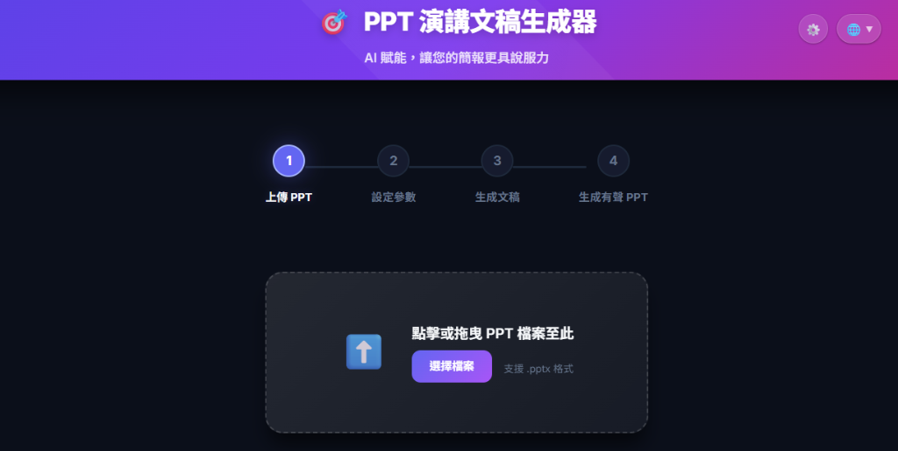
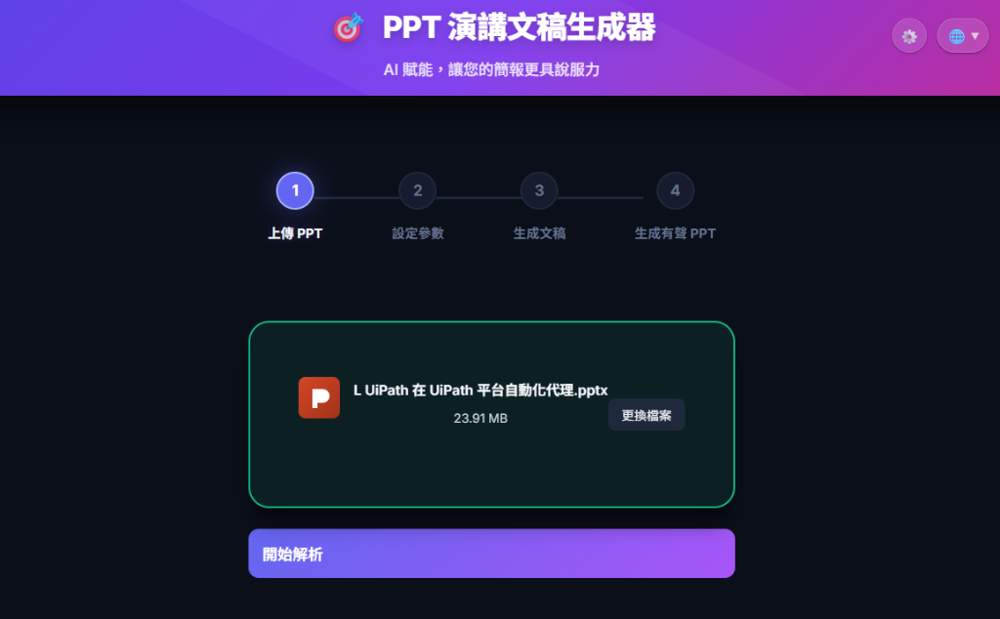
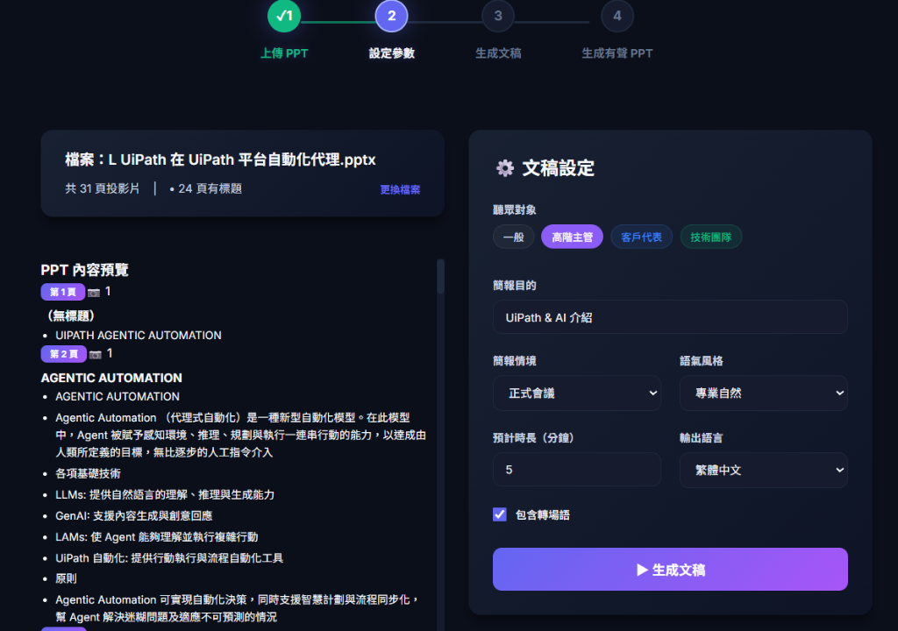
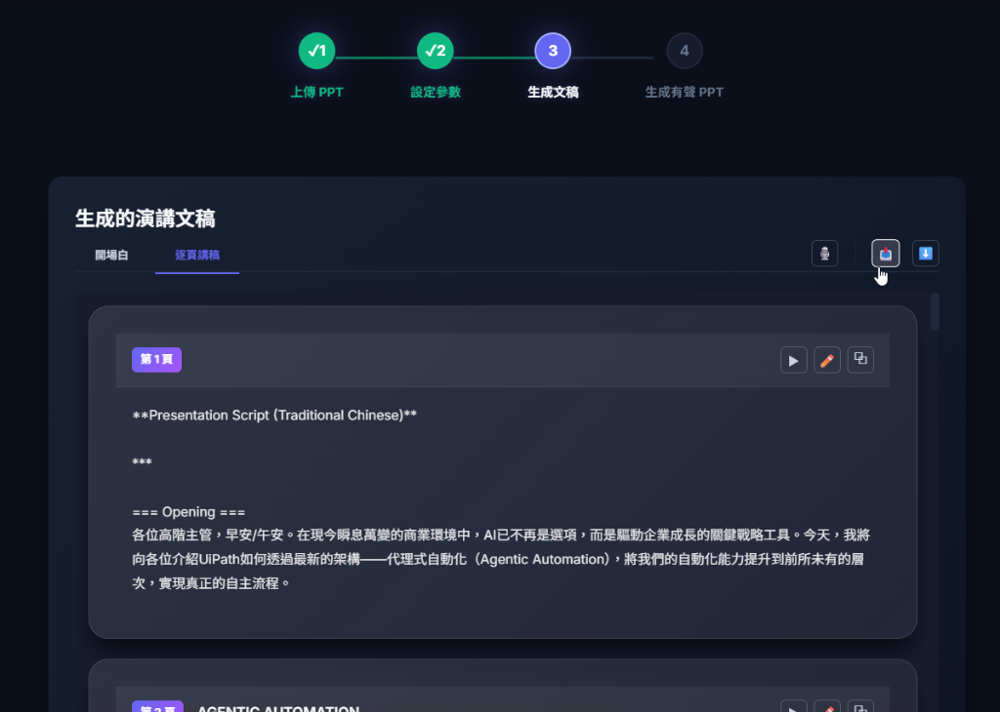
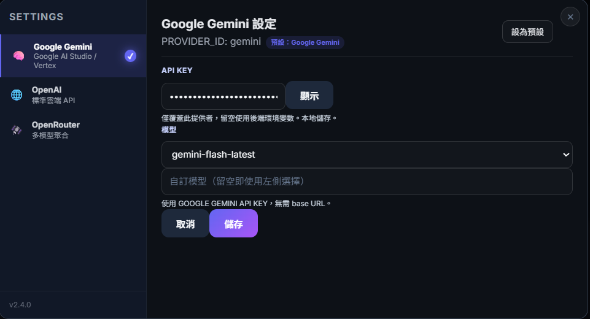
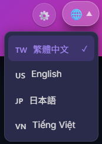
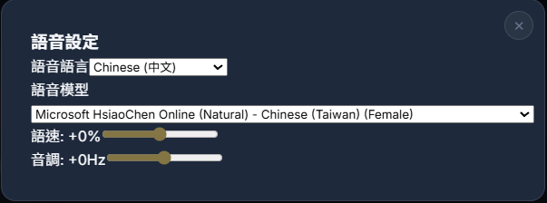

# 🎤 PPT 演講文稿生成器

> 自動為 PowerPoint 簡報生成專業演講文稿和有聲旁白

[](https://opensource.org/licenses/MIT)
[](https://www.python.org/downloads/)
[](https://nodejs.org/)

---

## ✨ 主要功能

- 🤖 **AI 智能生成** - 使用 Google Gemini AI 自動生成演講文稿
- 🎙️ **高品質 TTS** - 整合 Microsoft Edge TTS，支援多種語音
- 📋 **備忘稿同步** - 自動同步文稿到 PowerPoint 備忘稿
- 🎬 **自動播放** - 自動配置音訊播放和投影片轉場
- 🌍 **多語言支援** - 繁中、簡中、英文、日文、越南文

---

## 🚀 快速開始

### 系統需求

- Python 3.8+
- Node.js 16+
- Microsoft PowerPoint（用於備忘稿同步）
- Google Gemini API 金鑰（[免費申請](https://aistudio.google.com/app/apikey)）

### 安裝步驟

#### 1. 後端設置

```bash
cd backend
pip install -r requirements.txt

# 設置環境變數
copy .env.example .env
# 編輯 .env 填入您的 GEMINI_API_KEY

# 啟動後端
python -m uvicorn app.main:app --reload --port 8080
```

#### 2. 前端設置

```bash
cd frontend
npm install
npm run dev
```

- 前端：http://localhost:3000
- 後端：http://localhost:8080

### 🐳 Docker 啟動 (推薦)

如果您已安裝 Docker，可以使用以下命令快速啟動整個系統：

```bash
docker-compose up -d --build
```

- 前端：http://localhost:80
- 後端：http://localhost:8080
- 資料持久化：自動保存在 `backend/data.db` 與 `backend/uploads/`

---

## 📖 使用流程

### 1️⃣ 上傳 PPT

點擊「選擇檔案」或拖放 .pptx 檔案到上傳區域

<div align="center">



</div>

上傳後，點擊「開始解析」按鈕，系統會自動解析投影片內容，顯示投影片資訊和縮圖

<div align="center">



</div>

---

### 2️⃣ 設定參數

在右側「⚙️ 文稿設定」面板中配置生成參數：

- **聽眾對象**：例如：高階主管、客戶代表、內部團隊
- **簡報目的**：例如：產品介紹、進度報告、技術分享
- **簡報情境**：正式會議、內部分享、客戶簡報
- **語氣風格**：專業自然、輕鬆友善、熱情濃烈
- **預計時長**：設定演講的目標時間（分鐘）
- **輸出語言**：繁體中文、簡體中文、英文等

<div align="center">



</div>

---

### 3️⃣ 生成文稿

點擊「▶️ 生成文稿」按鈕，AI 會自動生成：

- **開場白**：吸引聽眾注意力的開場
- **逐頁講稿**：每張投影片的詳細說明
- **轉場語**：投影片間的自然連接（可選）

生成後可以：
- ✅ 即時預覽生成結果
- ✏️ 手動編輯和調整內容
- 🗂️ 一鍵複製到剪貼簿
- 📥 下載為 TXT 檔案

<div align="center">



</div>

---

### 4️⃣ 生成有聲 PPT（選用）

如果需要生成帶有音訊旁白的 PPT：

1. 點擊「生成有聲 PPT」按鈕
2. 系統會自動：
   - 🎙️ 生成 TTS 音訊
   - 🔗 嵌入音訊到 PPT
   - 📋 同步備忘稿
   - ⏱️ 設定自動播放
3. 下載完成的有聲 PPT

> 💡 **提示**：TTS 語音設定請參考下方「相關設定」章節

---

## ⚙️ 相關設定

### 1. LLM 設定 (Google Gemini)

在設定面板中配置您的 Google Gemini API 金鑰：

<div align="center">



</div>

**配置步驟：**
1. 點擊設定選單中的「Google Gemini」
2. 輸入您的 API 金鑰
3. 選擇模型（預設：gemini-flash-latest）
4. 點擊「儲存」完成配置

> 🔑 **取得 API 金鑰**：前往 [Google AI Studio](https://aistudio.google.com/app/apikey) 建立免費 API 金鑰

---

### 2. 語言切換

系統支援多種介面語言：

<div align="center">



</div>

**支援語言：**
- 🇨🇳 中文 (Chinese)
- 🇬🇧 英文 (English)
- 🇯🇵 日文 (Japanese)
- 🇻🇳 越南文 (Vietnamese)

點擊右上角的地球圖示即可切換介面語言。

---

### 3. TTS 語音設定

調整文字轉語音的參數：

<div align="center">



</div>

**可調整項目：**
- **語音語言**：選擇輸出語言（中文、英文等）
- **語音模型**：選擇不同的語音角色（男聲、女聲）
- **語速**：調整說話速度（-50% 至 +100%）
- **音調**：調整聲音高低（-50Hz 至 +50Hz）

---

## 🛠️ 技術棧

| 類別 | 技術 |
|------|------|
| **前端** | React 18, Vite, Vanilla CSS |
| **後端** | FastAPI, SQLAlchemy (SQLite), Python-PPTX |
| **部署** | Docker, Docker Compose |
| **AI** | Google Gemini API |

---

## ❓ 常見問題

### Q: 備忘稿為什麼是空的？

A: 確保：
- 已安裝 Microsoft PowerPoint
- 系統為 Windows
- PowerPoint 沒有被其他程式鎖定

### Q: API 配額用完了怎麼辦？

A: 您可以：
- 申請新的 Gemini API 金鑰
- 手動輸入文稿（不需要 API）
- 等待配額重置（通常每日重置）

### Q: 支援哪些檔案格式？

A: 支援 .ppt 和 .pptx 格式

---

## 📄 授權

本專案採用 MIT 授權 - 詳見 [LICENSE](LICENSE) 檔案

---

## 🙏 致謝

- [Google Gemini API](https://ai.google.dev/) - AI 文稿生成
- [Microsoft Edge TTS](https://github.com/rany2/edge-tts) - 文字轉語音
- [Python-PPTX](https://python-pptx.readthedocs.io/) - PowerPoint 處理

---

⭐ 如果這個專案對您有幫助，請給個星星！
