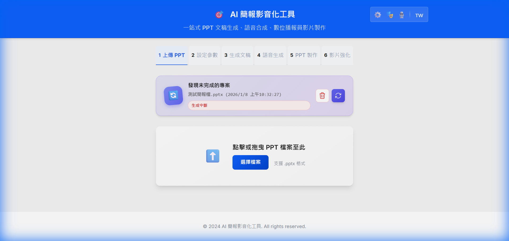

# 🎯 AI 簡報影音化工具

> 一站式 PPT 文稿生成、語音合成、數位播報員影片製作

[](https://opensource.org/licenses/MIT)
[](https://www.python.org/downloads/)
[](https://nodejs.org/)

---

## ✨ 主要功能

| 功能 | 說明 |
|------|------|
| 🤖 **AI 智能生成** | Google Gemini / Ollama / OpenRouter 多種 LLM 支援 |
| 🎙️ **高品質 TTS** | Microsoft Edge TTS，支援多語音角色與語速調整 |
| 🎭 **數位播報員** | SadTalker AI 生成真人說話影片 |
| 📋 **備忘稿同步** | 自動同步文稿到 PowerPoint 備忘稿 |
| 🎬 **自動播放** | 自動配置音訊/影片播放和投影片轉場 |
| 🌍 **多語言支援** | 繁中、英文、日文、越南文介面 |
| 📤 **Session 分享** | URL 參數分享，跨電腦繼續作業 |

---

## 📖 使用流程

本工具採用 **6 步驟流程**：

<div align="center">



</div>

### 1️⃣ 上傳 PPT
點擊「選擇檔案」或拖放 `.pptx` 檔案到上傳區域，系統會自動解析投影片內容

### 2️⃣ 設定參數
配置文稿生成參數：
- 聽眾對象、簡報目的、情境
- 語氣風格、預計時長
- 輸出語言

### 3️⃣ 生成文稿
AI 自動生成：
- **開場白** - 吸引聽眾注意力
- **逐頁講稿** - 每張投影片的詳細說明
- ✏️ 支援即時編輯和調整

### 4️⃣ 語音生成
使用 Microsoft Edge TTS 生成高品質語音：
- 多種語音角色選擇
- 可調整語速和音調
- 支援試聽預覽

### 5️⃣ PPT 製作
自動組裝有聲 PPT：
- 🔊 嵌入音訊檔案
- 📋 同步備忘稿
- ⏱️ 設定自動播放

### 6️⃣ 影片強化 (選用)
使用 SadTalker 生成數位播報員影片：
- 🎭 上傳播報員照片
- 🎬 AI 生成真人說話影片
- 📺 自動嵌入到 PPT

---

## 🚀 快速開始

### 系統需求

- Python 3.10+
- Node.js 18+
- CUDA GPU (數位播報員功能需要)
- Google Gemini API 金鑰 ([免費申請](https://aistudio.google.com/app/apikey))

### 安裝步驟

#### 1. 後端設置

```bash
cd backend
pip install -r requirements.txt

# 設置環境變數
copy .env.example .env
# 編輯 .env 填入您的 GEMINI_API_KEY

# 啟動後端
python -m uvicorn app.main:app --reload --host 0.0.0.0 --port 8080
```

#### 2. 前端設置

```bash
cd frontend
npm install
npm run dev -- --host
```

- 前端：http://localhost:5173
- 後端：http://localhost:8080

> ⚠️ **注意**：由於 SadTalker 需要 GPU 支援，本專案不建議使用 Docker 部署。請直接在本機運行以獲得最佳效能。

---


## ⚙️ 相關設定

### 1. LLM 設定

點擊右上角 ⚙️ 按鈕開啟 LLM 設定，支援：

| Provider | 說明 |
|----------|------|
| **Google Gemini** | 雲端 API，需要 API Key |
| **Ollama** | 本地運行 LLM，免費 |
| **OpenRouter** | 多模型聚合平台 |
| **OpenAI** | GPT 系列模型 |

### 2. 數位播報員設定

點擊 🎭 按鈕管理數位播報員：
- 上傳播報員照片
- 設定情緒強度、生成流暢度
- 選擇影片解析度 (480p/720p/1080p)

### 3. TTS 語音設定

點擊 🎙️ 按鈕調整語音參數：
- 語言選擇
- 語音角色
- 語速 (-50% ~ +100%)
- 音調 (-50Hz ~ +50Hz)

### 4. 多語系介面

點擊右上角語言選擇器切換介面語言：
- 🇹🇼 繁體中文
- 🇬🇧 English
- 🇯🇵 日本語
- 🇻🇳 Tiếng Việt

---

## 🛠️ 技術棧

| 類別 | 技術 |
|------|------|
| **前端** | React 18, Vite, i18next, Vanilla CSS |
| **後端** | FastAPI, SQLAlchemy (SQLite), Python-PPTX |
| **AI 語音** | Microsoft Edge TTS |
| **AI 影片** | SadTalker (Talking Head Generation) |
| **LLM** | Google Gemini, Ollama, OpenRouter |


---

## 📤 Session 分享

上傳 PPT 後，URL 會自動帶上 `?fileId=xxx` 參數。分享此 URL 給其他電腦，即可繼續作業。

```
http://192.168.x.x:5173/?fileId=abc-123-xyz
```

---

## ❓ 常見問題

### Q: 數位播報員生成很慢？

A: SadTalker 需要 GPU 加速：
- 確保已安裝 CUDA 版 PyTorch
- 建議使用 RTX 3060 以上顯卡
- 首次運行會下載模型 (~2GB)

### Q: 多人同時使用出現衝突？

A: SadTalker 一次只能處理一個請求，需等待前一個完成。

### Q: API 配額用完了？

A: 您可以：
- 切換到 Ollama (本地免費)
- 申請新的 Gemini API 金鑰
- 等待配額重置（每日）

---

## 📄 授權

本專案採用 MIT 授權 - 詳見 [LICENSE](LICENSE) 檔案

---

## 🙏 致謝

- [Google Gemini API](https://ai.google.dev/) - AI 文稿生成
- [Microsoft Edge TTS](https://github.com/rany2/edge-tts) - 文字轉語音
- [SadTalker](https://github.com/OpenTalker/SadTalker) - 數位播報員生成
- [Python-PPTX](https://python-pptx.readthedocs.io/) - PowerPoint 處理

---

⭐ 如果這個專案對您有幫助，請給個星星！
